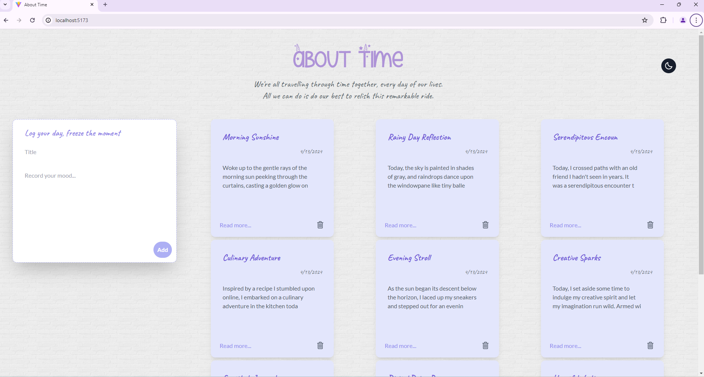
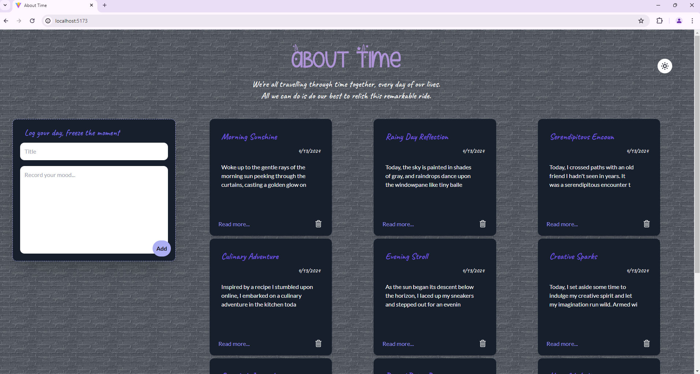

# A Simple Tailwind CSS Tech Demo

 
 
 
 

In recent years, more and more developers have begun to adopt Tailwind. The website [State of CSS](https://2023.stateofcss.com/en-US/css-frameworks/) demonstrates a rapid increase in Tailwind's awareness and usage ratios, with its interest and retention ratios consistently ranking first.

Tailwind is a utility-first CSS framework that facilitates rapid customization of user interfaces by employing small utility classes directly in HTML. Unlike component-based frameworks such as Bootstrap or Material UI, Tailwind offers minimal predefined styles, granting developers complete freedom to craft their own styles.

## Table of Contents 

The following sections provide information on:

- [How to run this project](#How-to-run-this-project) : Instructions on how to set up and run the project.
- [Introduction of my codebase](#Introduction-of-my-codebase) : An overview of the "About Time" diary app's structure and features.
- [React icon npm package](#React-icon-npm-package) : Details about sourcing icons using the `react-icons` library.
- [Other related resources](#Other-related-resources) : Links and descriptions of additional websites and extensions referenced in the video.

**You can also find a tech demo video I made by clicking [the link here](https://drive.google.com/file/d/1SJhMH9YJhnocJrUk-7rrFfuU-64vGOv8/view?usp=sharing).**

---

## How to run this project? 

To run this project, simply execute `npm install` and `npm run dev` in your terminal.

For setting up Tailwind CSS in your React + Vite project, follow these steps:

1. Install `tailwindcss` and its peer dependencies by running the following commands:

   ```
   npm install -D tailwindcss postcss autoprefixer
   npx tailwindcss init -p
   ```

2. Configure your template paths by adding the following code to the `tailwind.config.js` file:

   ```javascript
   module.exports = {
     content: ["./src/**/*.{html,js,jsx,ts,tsx}"],
     theme: {
       extend: {},
     },
     plugins: [],
   };
   ```

3. Add Tailwind directives to your CSS by copying the following code to the `index.css` file:

   ```css
   @tailwind base;
   @tailwind components;
   @tailwind utilities;
   ```

   For more detailed instructions, please refer to the official Tailwind guide: https://tailwindcss.com/docs/installation

<br />

## Introduction of my codebase 

My app, "About Time," is a simple diary app designed to capture users' daily thoughts. It comprises four components: header, create area, note area, and footer. Users can add and delete notes, each containing a title, creation date, and content. Additionally, the app supports dark mode for improved usability in low-light environments. 

With future database setup and backend development, "About Time" could serve as a comprehensive tool for recording and reflecting on users' daily experiences.

(Part of the HTML and JavaScript code used in this project is sourced from the [Complete Web Development Bootcamp](https://www.udemy.com/course/the-complete-web-development-bootcamp/) on Udemy.)




<br />

## React icon npm package 

Icons in my project are sourced from the [`react-icons` library](https://www.npmjs.com/package/react-icons). To utilize these icons, install the package via npm:

```
npm install react-icons --save
```

Then, follow the specific icon library's instructions for usage. 

For instance, if you wish to incorporate the Alipay circle icon into your component(s), follow these steps:

1. Navigate to the "Ant Design Icons" section.
2. Copy the import line, which typically looks like `import { IconName } from "react-icons/ai";`, into your component(s).
3. Then, within your HTML code, add `<AiFillAlipayCircle />` to display the icon.

<br />

## Other related resources

1. **Tailwind Documentation**: Offers instant access to Tailwind's documentation.
2. **Tailwind IntelliSense**: Provides real-time suggestions for Tailwind CSS classes, enhancing coding efficiency.
3. **[Tailwind Play](https://play.tailwindcss.com/)**: The official CSS playground provided by Tailwind.
4. **[Tailblocks](https://tailblocks.cc/)**: Contains numerous responsive, dark mode-compatible templates for quick deployment.
5. **[Shadcn/UI](https://ui.shadcn.com/)**: A popular library offering pre-designed, reusable UI components with customizable themes. Can be used alongside Tailwind CSS for additional customization.
6. **[Transparent Textures](https://www.transparenttextures.com/)**: Provides special textures for website backgrounds.
7. **[UIColors](https://uicolors.app/create)**: An easy-to-use Tailwind CSS color generator.
